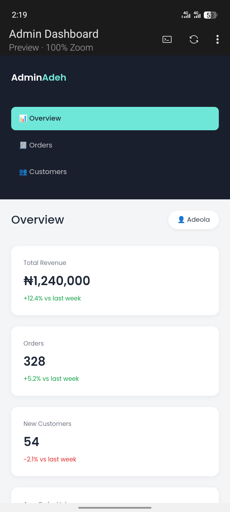

# Admin Dashboard

A responsive admin dashboard built with HTML, CSS, and JavaScript, featuring an overview page with stats and a live sales chart, a searchable orders table, and a customers view.

## Preview

## Links

Solution link: [https://github.com/DevAdeh/Admin-Dashboard-.git]

Live link: [https://your-live-link-here.vercel.app/]

## Features
- Sidebar navigation between Overview, Orders, and Customers pages
- Stat cards showing revenue, orders, new customers, and average order value
- Live sales chart (last 7 days) using Chart.js
- Searchable orders table that filters as you type
- Customer cards with auto-generated initials as avatars

## How it works
The dashboard is a single HTML page with three sections that show and hide based on which sidebar link is clicked. Stats, orders, and customers are all rendered dynamically from JavaScript data using template literals. The orders table filters live as the user types in the search box, checking the customer name, item, and order ID against what's typed. The sales chart is rendered using Chart.js, pulling from a simple array of daily sales figures.

## Tech used
- HTML
- CSS
- JavaScript (DOM manipulation, dynamic rendering, live search filtering)
- [Chart.js](https://www.chartjs.org/) (data visualization)

## How to use
1. Clone or download this repo
2. Open `index.html` in your browser
3. Use the sidebar to switch between Overview, Orders, and Customers
4. Try searching the Orders table by customer name, item, or order ID

## Project structure

admin-dashboard/
├── index.html
├── style.css
├── script.js
└── README.md

## Author
Adeola Ejikunle — [GitHub](https://github.com/DevAdeh)